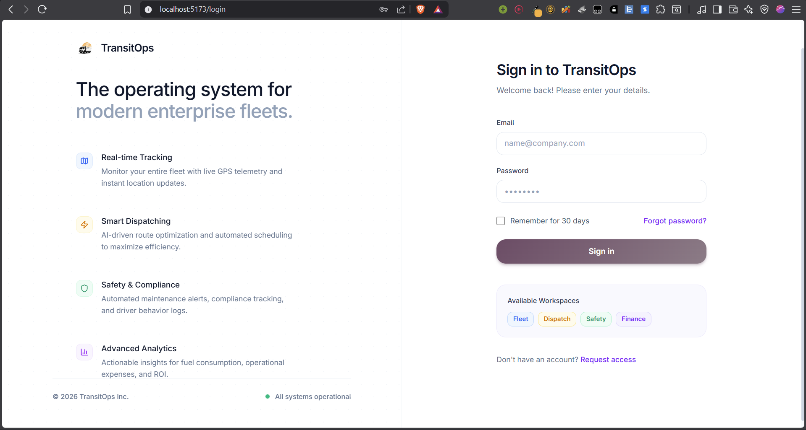
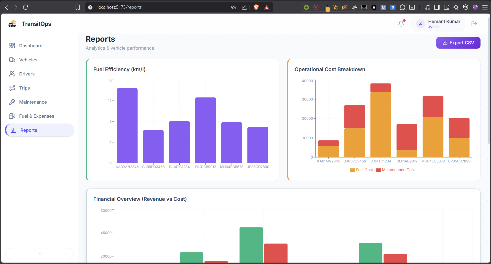
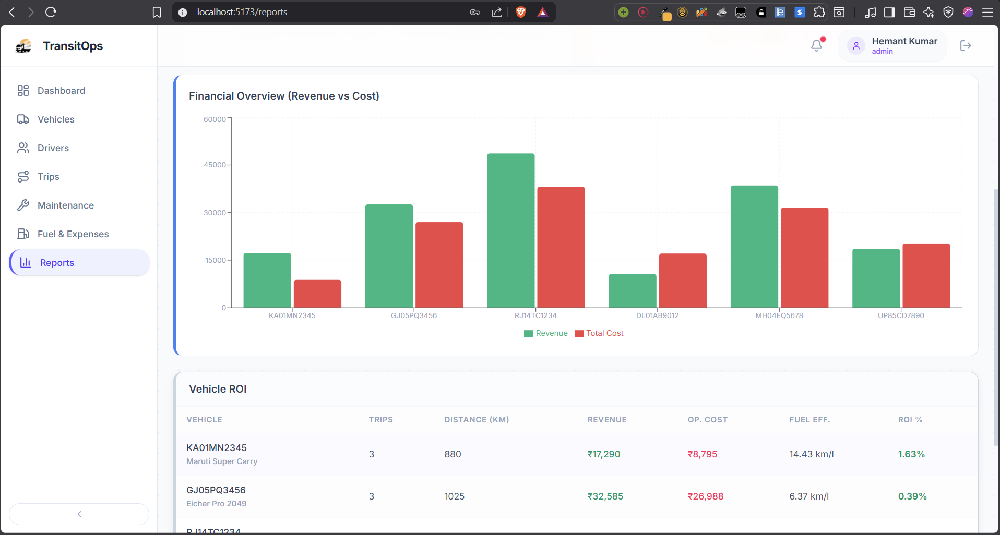
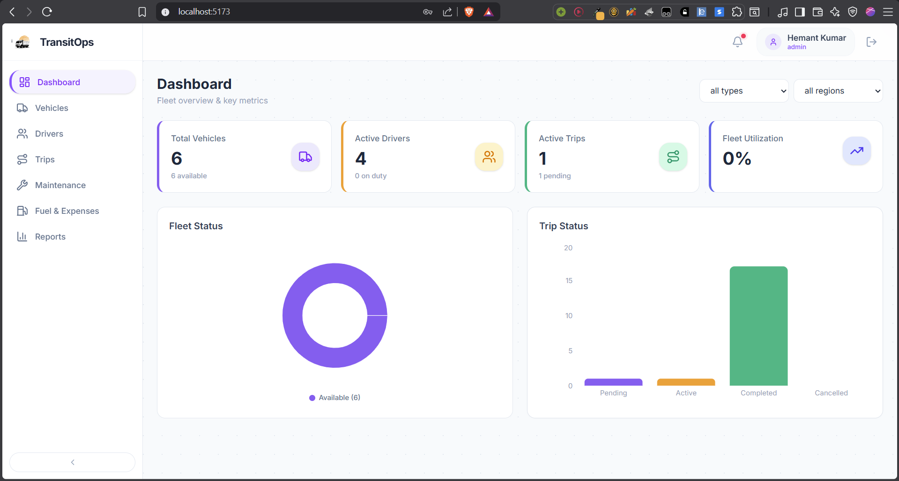
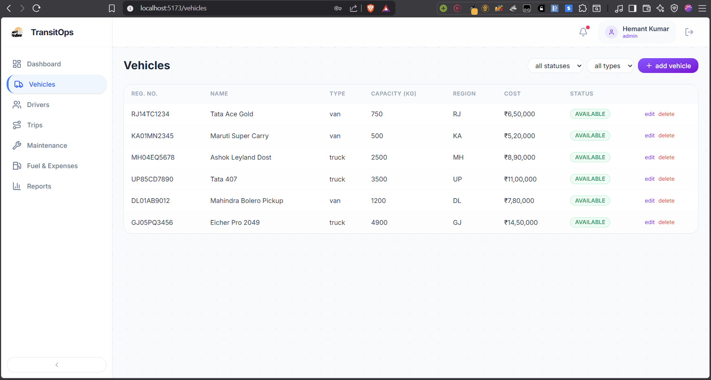
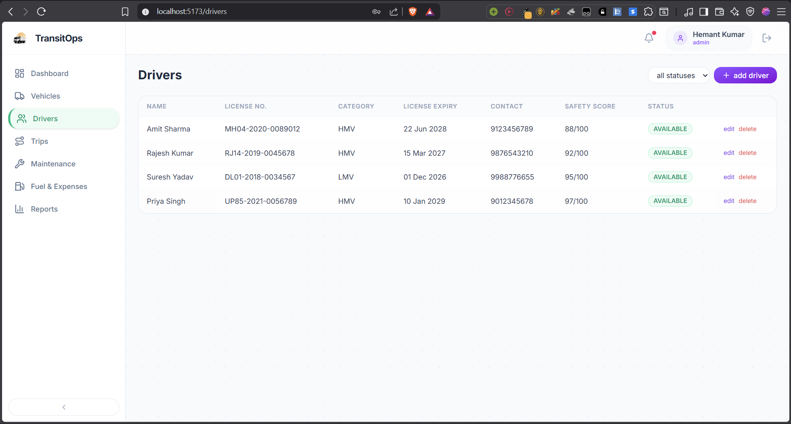
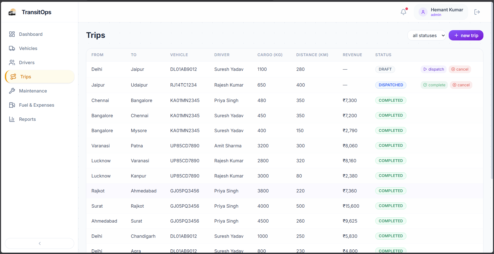
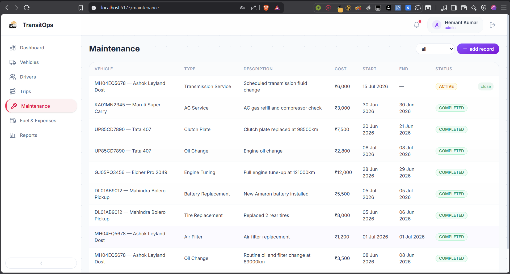
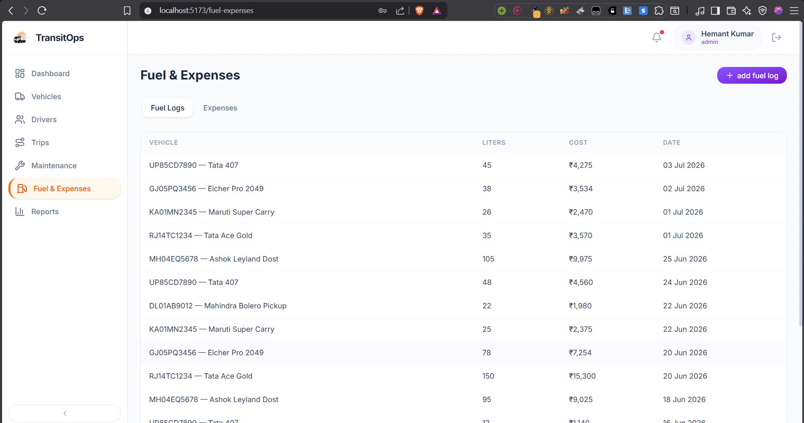

# TransitOps

**Smart Transport Operations Platform** — a centralized system to digitize vehicle, driver, dispatch, maintenance, and expense management with enforced business rules and operational insights.

---

### Login


### Reports & Analytics




### Dashboard


### Trips


### Vehicles


### Drivers


### Maintenance


### Fuel & Expenses


---

### Prerequisites

- Node.js 20+
- PostgreSQL (or use Docker Compose)

### Setup

```bash

git clone https://github.com/hemantch01/transitOps-odoo.git
cd transitOps-odoo

cp .env.example .env

npm install
cd client && npm install && cd ..
cd server && npm install && cd ..

cd server
npx prisma migrate dev
npm run db:seed
cd ..

cd server && npm run dev
```

### Docker

```bash
docker-compose up
```

---
